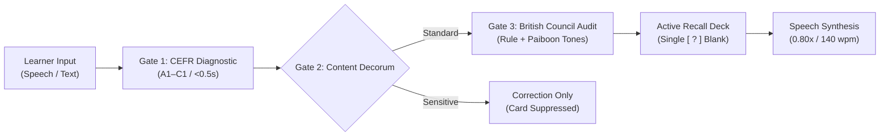

# Cambridge English Standard

> Automated CEFR formative assessment and cued-recall spaced repetition engine for English language learners, with contrastive L1 Thai phonetic anchoring.

<p align="center">
  
  
  
  
  
  
  
</p>

<div align="center">
  
  <p><sub>Figure 1: Canonical Linguo formative card archetypes across 3 narrative environments and CEFR topics. Left: <b>Retro Sci-Fi Cyberpunk</b> (Past Simple / The Time Paradox, A2). Center: <b>Fantasy RPG Guild</b> (Verb Patterns / The "To" Toll, B1). Right: <b>Tactical Steampunk</b> (Prepositions & Gerunds / The Gerund Vest, B1). Each card visualizes the grammatical resolution through physical slapstick mechanics.</sub></p>
</div>

---

## Component Architecture Matrix

| Subsystem | Directory / Module | Core Functionality | Primary Tech Stack | Verification & Tests |
| :--- | :--- | :--- | :--- | :--- |
| **Core Engine** | [`linguo/core/`](file:///Users/sam/linguo/linguo/core/) | SQLite WAL persistence, Pydantic v2 schemas, Gate 2 content filter, telemetry & tracing | Python 3.12, SQLite WAL | 26 unit tests passing |
| **Audio Pipeline** | [`linguo/audio/`](file:///Users/sam/linguo/linguo/audio/) | 2-thread local CPU Kokoro-82M (English) + Edge-TTS Thai neural speech synthesis | PyTorch, soundfile, ffmpeg | 24kHz studio verified |
| **Pedagogy & Decks** | [`linguo/pedagogy/`](file:///Users/sam/linguo/linguo/pedagogy/) | Gate 3 British Council audit, 15-card starter deck, native `.apkg` & `.tsv` exporters | Anki 2.0 schema, zipfile | Export validated |
| **Platform Runtime** | [`linguo/platform/`](file:///Users/sam/linguo/linguo/platform/) | macOS Menu Bar LaunchAgent, AppleScript auto-paste (Cmd+V), system audio feedback | PyObjC, Launchd, osascript | Verified on macOS |
| **Native HUD (GUI)** | [`gui/dash-gui/`](file:///Users/sam/linguo/gui/dash-gui/) | Metal/egui 16-bit arcade HUD with active recall flashcard mode & audio playback | Rust 2021, egui, eframe | 4 Cargo tests passing |
| **API Server (Dell)** | [`scripts/linguo_server.py`](file:///Users/sam/linguo/scripts/linguo_server.py) | High-performance FastAPI server, OpenMetrics `/metrics`, W3C trace propagation | FastAPI, Uvicorn, Prometheus | 11 unit tests passing |
| **Deployment Stack** | [`config/`](file:///Users/sam/linguo/config/) | systemd service unit, Cloudflare Tunnel ingress, Prometheus scrape configuration | systemd, cloudflared | Port 8765 operational |
| **Test Harness** | [`tests/`](file:///Users/sam/linguo/tests/) | Unified 11-phase harness, isolated E2E sandbox proving zero host contamination | Bash, pytest, curl, urllib | 11/11 phases passing |

---

## Pedagogical Validation Pipeline



* **Gate 1 (Real-Time Diagnostic)**: Evaluates input against CEFR levels (A1–C1) within $<0.5\text{s}$ using Pydantic v2 schemas.
* **Gate 2 (Decorum & Ethics)**: Deterministic filter. Educational corrections are returned; permanent card minting is suppressed for sensitive topics (`SENSITIVE_NO_CARD`).
* **Gate 3 (Formative Audit)**: Synthesizes recurrent structural gaps into canonical British Council grammar rules, verifies 5-tone Paiboon notation, and commits immutable challenge cards into 3 narrative archetypes.

---

## Canonical Narrative Archetypes

| Archetype | Narrative Setting | Slapstick Mechanic | Target Grammar Domain |
| :--- | :--- | :--- | :--- |
| **Retro Sci-Fi Cyberpunk** | Neon-drenched alley, temporal wormhole, holographic *"Grammar Police"* | Cyborg time-cop tackles fleeing courier inserting glowing neon **`WENT`** cube to stop temporal continuum collapse | `CEFR A2 • Past Simple`<br/>*e.g. `YESTERDAY I [ ? ]`* |
| **Fantasy RPG Guild** | Mountain bridge over mist leading to Guildhall castle, ancient stone runes | Pompous goblin toll-collector in wizard robes demands giant golden **`TO`** token from perplexed barbarian knight | `CEFR B1 • Verb Patterns`<br/>*e.g. `I WANT [ ? ] ENTER`* |
| **Tactical Steampunk** | Stormy naval battleship deck, steam pipes, churning ocean waves | Frantic naval captain with megaphone forces giant orange life-vest labeled **`WEARING (-ING)`** onto diving sailor | `CEFR B1 • Gerunds`<br/>*e.g. `DON'T JUMP WITHOUT [ ? ] A VEST`* |

---

## Pre-Loaded Starter Deck (15 CEFR Archetypes)

To eliminate cold-start dormancy, fresh installations immediately seed 15 canonical Cambridge/British Council recall cards:

| # | Error Category | Card Title | CEFR | Challenge Puzzle Slot | Target Word |
| :-: | :--- | :--- | :-: | :--- | :--- |
| 1 | `ARTICLES` | The Market Stamp | B1 | `I am going to [  ?  ] market tomorrow morning.` | **THE** |
| 2 | `VERB_PATTERNS` | The 'To' Toll | B1 | `I want [  ?  ] refactor this monolithic codebase.` | **TO** |
| 3 | `PREPOSITIONS` | The Gerund Life Vest | B1 | `Always run the unit tests before [  ?  ] the PR.` | **MERGING** |
| 4 | `TENSES` | The Time Paradox | A2 | `Yesterday I [  ?  ] to the central market.` | **WENT** |
| 5 | `AGREEMENT` | The Lone S-Gun | A1 | `Every developer on our team [  ?  ] clean code.` | **FOLLOWS** |
| 6 | `SINCE_FOR` | The Duration Clock | B1 | `She has been studying English [  ?  ] three years.` | **FOR** |
| 7 | `MAKE_DO` | The Factory Protocol | B1 | `Don't be afraid to [  ?  ] mistakes when speaking.` | **MAKE** |
| 8 | `MUCH_MANY` | The Grain Measure | A2 | `How [  ?  ] unit tests did you write for this?` | **MANY** |
| 9 | `SAY_TELL` | The Dispatch Receiver | B1 | `The senior engineer [  ?  ] me to check logs.` | **TOLD** |
| 10 | `PARTICIPLE_ADJ` | The Emotion Battery | B1 | `The lecture was long, so all attendees felt [  ?  ].` | **BORED** |
| 11 | `STILL_ALREADY` | The Radar Sweep | B1 | `Are you [  ?  ] debugging that concurrency issue?` | **STILL** |
| 12 | `FIRST_CONDITIONAL` | The Probability Gate | B2 | `If the test suite passes, we [  ?  ] deploy tonight.` | **WILL** |
| 13 | `USED_TO` | The Retro Timeline | B2 | `Before pipelines, we [  ?  ] deploy manually.` | **USED TO** |
| 14 | `DEPENDENT_PREP` | The Gravity Anchor | B1 | `The server latency depends [  ?  ] network route.` | **ON** |
| 15 | `FEW_A_FEW` | The Ration Gauge | B1 | `Don't panic: we still have [  ?  ] minutes left.` | **A FEW** |

---

## Quickstart

```bash
# 1. Clone and install
git clone https://github.com/gptprojectmanager/linguo.git
cd linguo && ./install.sh

# 2. Run diagnostics and unified test suite (11/11 phases passing)
./tests/test_all.sh

# 3. Assess a phrase via CLI
linguo "I go to market yesterday"

# 4. Export active deck (Native Anki .apkg + TSV)
linguo export            # Generates cards_anki_export.apkg & cards_anki_export.tsv
linguo export apkg       # Native Anki package with 16-bit arcade styling

# 5. (Optional) Deploy operational stack on Linux / Dell 7670
./scripts/deploy_dell.sh
```

---

## License

MIT License. Open CALL reference implementation.
