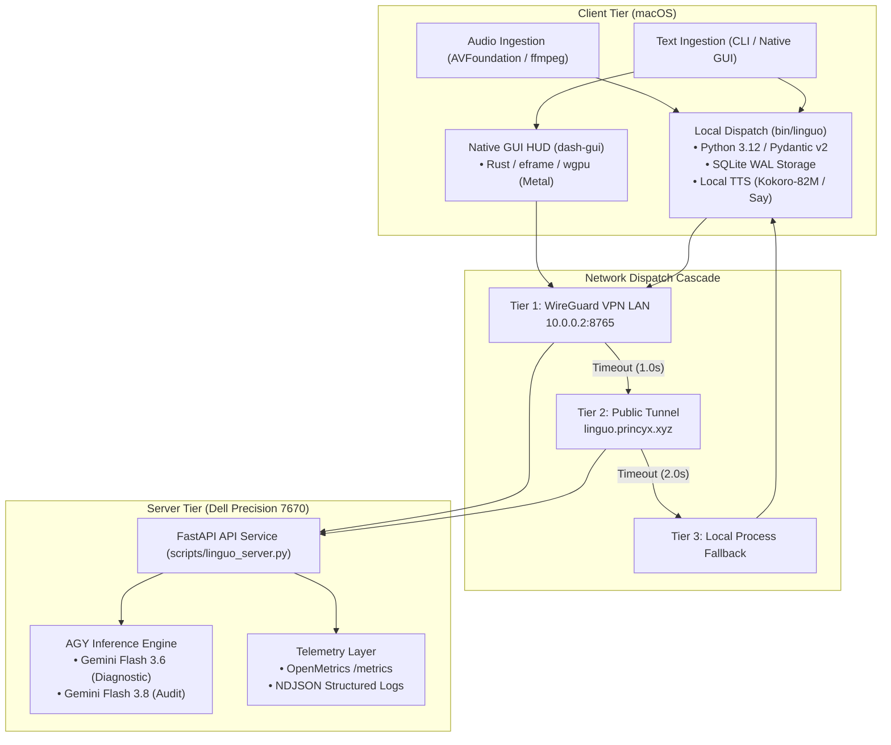
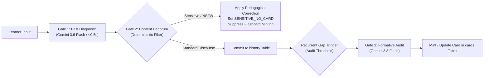
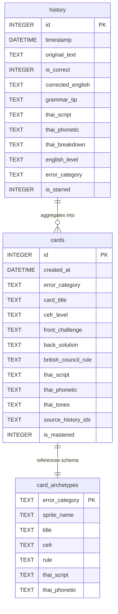

# Linguo: Cambridge English Standard

## Abstract

Linguo is an automated language assessment and retention platform engineered for second-language acquisition (SLA) research and instructional delivery. The system provides automated formative assessment for English language learners, with specialized contrastive linguistic scaffolding for native speakers of Thai. Structural errors are captured from spoken audio or typed input, categorized according to the Common European Framework of Reference for Languages (CEFR), evaluated against prescriptive grammatical standards, and synthesized into single-blank cued-recall items. The runtime environment comprises a native macOS ingestion client, a dual-engine speech synthesis pipeline, an offline SQLite ledger, and an optional remote inference backend equipped with OpenMetrics telemetry and structured logging.

<div align="center">
  
  <p><em>Figure 1: Sample cued-recall item illustrating single-target extraction, prescriptive rule formulation, and L1 Thai contrastive gloss.</em></p>
</div>

---

## 1. Linguistic and Pedagogical Rationale

### 1.1 Contrastive Analysis (L1 Thai $\rightarrow$ L2 English)

Adult native speakers of Thai encounter well-documented morphosyntactic challenges when acquiring English. As an isolating language within the Kra-Dai family, Thai exhibits:
* An absence of grammatical inflection for tense and aspect (aspect is expressed via invariant pre-verbal or post-verbal markers such as แล้ว `lɛ́ɛw` or กำลัง `kam-lang`).
* An absence of grammatical number, grammatical gender, and subject-verb agreement morphology.
* An absence of indefinite and definite article systems (determinacy is contextual or expressed through numeral classifiers).
* Rigid analytic word order with invariant verbal complements (e.g., absence of infinitive marker `to` following modal and semi-modal auxiliaries).

Linguo maps recurrent errors directly to these structural transfer divergences:

| Structural Domain | L1 Thai Substrate Interference | Target L2 English Form | Contrastive Diagnostic |
| :--- | :--- | :--- | :--- |
| **Articles** | Invariant bare noun (ไปตลาด) | Definite article for specific destination (*to the market*) | Insertion of obligatory determiner |
| **Verb Complementation** | Unmarked serial verbs (ต้องไป) | Obligatory infinitive particle (*need to go*) | Complement clause linking particle |
| **Tense & Aspect** | Temporal adverbials without inflection (ไปเมื่อวาน) | Past simple morphological inflection (*went yesterday*) | Morphological tense marking |
| **Subject-Verb Agreement** | Invariant verbal stem | Third-person singular marker (*he works*) | Agreement concord |

### 1.2 Cognitive Model: Cued Recall vs. Recognition

The instructional methodology relies on the testing effect (Roediger & Karpicke, 2006) and the principle of desirable difficulties (Bjork, 1994). Recognition-based exercises (such as multiple-choice questions) frequently assess passive familiarity rather than productive retrieval. Linguo restricts challenge items to **cued production**:
* The input utterance is parsed to isolate the single locus of grammatical failure.
* The item presents a complete sentence containing exactly one blank: `[  ?  ]`.
* The learner must actively produce the missing morpheme, particle, or auxiliary prior to inspecting the validated target form.

---

## 2. System Architecture

The software architecture is divided into an input/ingestion tier on macOS and an optional inference and telemetry service on Linux.



### 2.1 Ingestion and Execution Cascade
1. **Audio Capture**: Hardware microphone input is captured via `ffmpeg` utilizing macOS AVFoundation (`-f avfoundation -i ":0"`), sampled at 22.05 kHz mono, and serialized to temporary storage.
2. **Text Capture**: Evaluated through command-line invocation (`bin/linguo "<phrase>"`) or the native Rust HUD text field.
3. **Dispatch Cascade**:
   * **Tier 1 (Private WireGuard)**: Latency probe to `http://10.0.0.2:8765/health` (1.0s timeout).
   * **Tier 2 (Public Tunnel)**: Fallback probe to `https://linguo.princyx.xyz/health` (2.0s timeout).
   * **Tier 3 (Local Offline Subprocess)**: Direct local invocation of the engine using local resources when network interfaces are unavailable.

---

## 3. Evaluation Pipeline and Quality Gates

Every learner input traverses a deterministic three-gate evaluation sequence:



### Gate Specifications

* **Gate 1: Fast Diagnostic Evaluation**
  * *Latency*: $<0.5\text{ seconds}$.
  * *Responsibility*: Parse syntactical structures, classify error category into a closed vocabulary (`ARTICLES`, `PREPOSITIONS`, `VERB_PATTERNS`, `TENSES`, `WORD_ORDER`, `AGREEMENT`, `COLLOCATIONS`, `NONE`), assign CEFR proficiency level (A1–C1), and generate a native phonetic Thai transliteration.
  * *Validation*: Enforced via Pydantic v2 schemas (`LinguoAnalysis`) with automated normalization of category identifiers.
* **Gate 2: Decorum and Content Safety Filter**
  * *Latency*: $<1\text{ millisecond}$.
  * *Responsibility*: Deterministic scanning for explicit, violent, or sensitive vocabulary.
  * *Pedagogical Policy*: Grammatical analysis and error correction remain available to the learner, but the item is tagged with `error_category = "SENSITIVE_NO_CARD"`, preventing the creation of persistent flashcards or challenge decks.
* **Gate 3: Formative Gap Audit**
  * *Latency*: $2.0 - 4.0\text{ seconds}$.
  * *Responsibility*: Aggregates recurrent error clusters by structural category, formulates an authoritative grammar rule, validates five-tone Paiboon phonetic notation, and maps the challenge into a deterministic card schema.

---

## 4. Item Representation and Persistence Schema

All user interactions and generated pedagogical items are stored in SQLite operating with Write-Ahead Logging (`PRAGMA journal_mode=WAL;`).



### Item Mastery State Lifecycle
* **Active State (`is_mastered = 0`)**: Assigned upon generation. The item remains in the active review pool.
* **Graduation (`is_mastered = 1`)**: When subsequent learner utterances demonstrate three consecutive error-free productions within the associated structural category, the card transitions to mastered status.
* **Recidivism Reactivation**: Any subsequent recurrence of an error within that category resets the streak counter and restores the card to active status (`is_mastered = 0`).
* **Anki TSV Interoperability**: Card sets are exportable to standard tab-delimited files (`cards_anki_export.tsv`) containing challenge prompts, explanations, Thai phonetic anchors, and CEFR indicators.

---

## 5. Acoustic Delivery and Phonetic Benchmarks

### 5.1 Speech Rate Calibration
Non-native auditory comprehension degrades significantly at native conversational rates ($170 - 190\text{ wpm}$), primarily due to phonological reductions, elisions, and weak forms. Linguo standardizes synthesis rates to a didactic velocity:
$$\text{Rate}_{\text{didactic}} = 175\text{ wpm} \times 0.80 = 140\text{ wpm}$$

This calibration is unified identically across the Python CLI and the native Rust HUD:
```rust
let rate = (175.0 * config.speed).round() as i32;
```

### 5.2 Phonetic Models and Tonal Representation
* **English Synthesis**:
  * *Neural Offline*: Kokoro-82M (82M parameter weights, local execution via PyTorch on CPU, 24 kHz).
  * *Neural Edge*: Azure Cognitive Speech models (`en-US-JennyNeural`, `en-GB-SoniaNeural`).
  * *System Built-in*: Apple Speech Synthesis (`Samantha`, `Alex`).
* **Thai Tonal Mapping**: Uses standardized Paiboon phonetic transcription with explicit five-tone pitch notation:
  $$\text{Mid } (\text{plain}) \quad\mid\quad \text{Low } (\text{à}) \quad\mid\quad \text{High } (\text{á}) \quad\mid\quad \text{Falling } (\text{â}) \quad\mid\quad \text{Rising } (\text{ǎ})$$

---

## 6. Observability and Telemetry Specification

The backend server (`scripts/linguo_server.py`) provides an institutional telemetry contract designed for ingestion by Prometheus, OpenTelemetry, Vector, and Grafana Loki.

```
[Client (CLI / GUI)] ──(X-Trace-Id / JSON)──> [FastAPI Server (scripts/linguo_server.py)]
                                                       │
         ┌─────────────────────────────────────────────┼─────────────────────────────┐
         ▼                                             ▼                             ▼
   [Prometheus]                                 [Vector / Loki]               [Distributed Tracing]
   GET /metrics                                 NDJSON Event Stream           W3C Header Context
   • linguo_requests_total                      • timestamp (ISO 8601)        • X-Trace-Id propagation
   • linguo_request_duration_seconds            • log level, service          • End-to-end auditability
   • linguo_inference_duration_seconds          • duration_ms, client_ip
   • linguo_active_requests                     • category, meta
```

### Telemetry Endpoints
* `GET /health/live`: Process liveness verification returning HTTP 200.
* `GET /health/ready`: System readiness verification checking local file permissions, workspace availability, and inference runtime accessibility. Returns HTTP 503 if degraded.
* `GET /metrics`: Standard OpenMetrics text format exposing latency distributions, request rates, token estimates, and safety gate counters.
* `NDJSON Stream`: Log events written to `linguo_events.jsonl` formatted as single-line JSON objects with ISO 8601 timestamps and trace identifiers.

---

## 7. Verification and Automated Test Suite

The codebase enforces continuous regression testing across 11 sequential test phases.

```bash
# Execute the comprehensive test suite
./tests/test_all.sh
```

### Verification Matrix

| Phase | Scope | Technology | Verification Target |
| :--- | :--- | :--- | :--- |
| **1/11** | Syntax & Compilation | `py_compile` | Bytecode validation of CLI and server scripts |
| **2/11** | Unit Test Suite (Core & API) | `pytest` (33 tests) | Pydantic schema healing, config roundtrips, auth gates, OpenMetrics exposition |
| **3/11** | Native HUD Unit Suite | `cargo test` (4 tests) | Struct serialization, rate math, and local network bypass |
| **4/11** | Schema Integrity | Python / Pydantic | Pydantic v2 type assertion and field validators |
| **5/11** | System Diagnostics | `linguo --doctor` | Subprocess dependencies, filesystem paths, binary availability |
| **6/11** | Ledger & Concurrency | SQLite WAL | Database file creation, WAL mode, table indexes |
| **7/11** | Pedagogical Audit Engine | `linguo --audit` | Batch evaluation and card compilation |
| **8/11** | Anki Export Pipeline | `linguo --export` | TSV format validation and field delimiter verification |
| **9/11** | Decorum Safety Gate | Content Filter | Rejection of sensitive terms into `SENSITIVE_NO_CARD` |
| **10/11** | macOS Menu Bar Daemon | LaunchAgent | `com.linguo.bar.plist` registration and process status |
| **11/11** | Isolated E2E Sandbox | `test_e2e_isolated.py` | Full client-server lifecycle in `/tmp`, asserting **zero host contamination** |

---

## 8. Installation and Deployment

### 8.1 Prerequisites
* macOS 13.0 or higher.
* Python 3.10+ with `pip`.
* Optional: Rust 1.80+ (for building the native HUD).
* Optional: `ffmpeg` (for local microphone recording).

### 8.2 Installation

```bash
# Clone the repository
git clone https://github.com/gptprojectmanager/linguo.git
cd linguo

# Run installer (sets up symlinks and base dependencies)
./install.sh

# Build the native 60fps Metal HUD (optional)
./install_gui.sh
```

### 8.3 Configuration CLI Reference

The configuration file is maintained at `~/.local/share/linguo/config.json`. Values can be inspected or updated via the CLI:

```bash
# Display the active configuration matrix
linguo config

# Adjust the real-time inference model
linguo config model balanced      # Options: fast (3.6 Low), balanced (3.7), pro (3.8 High)

# Adjust the speech rate (0.5x - 2.0x, recommended 0.8x)
linguo config speed 0.80

# Select voice model
linguo config voice af_nicole     # Options: af_nicole, am_adam, Samantha, Alex

# Set network dispatch mode
linguo config route auto          # Options: auto, dell, local
```

### 8.4 Server Deployment

To run the remote backend on a centralized host:
```bash
python3 -m uvicorn scripts.linguo_server:app --host 0.0.0.0 --port 8765
```

---

## 9. License and Citation

* **License**: MIT License.
* **Repository**: [https://github.com/gptprojectmanager/linguo](https://github.com/gptprojectmanager/linguo)
* **Citation**:
```bibtex
@software{linguo2026,
  author = {Linguo Project Contributors},
  title = {Linguo: Cambridge English Standard},
  year = {2026},
  url = {https://github.com/gptprojectmanager/linguo}
}
```
