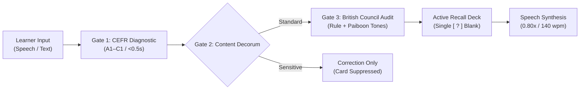

# Cambridge English Standard

> Automated CEFR formative assessment and cued-recall spaced repetition engine for English language learners, with contrastive L1 Thai phonetic anchoring.

<div align="center">
  
  <p><sub>Figure 1: Sample cued-recall card generated by Linguo (The Market Puzzle, CEFR B1). Combines single-blank active retrieval, British Council prescriptive grammar rule, Thai Paiboon gloss, and British educational visual comedy.</sub></p>
</div>

---

## Architecture



---

## Pedagogical Validation Gates

* **Gate 1 (Real-Time Diagnostic)**: Evaluates input against CEFR levels (A1–C1) within $<0.5\text{s}$ using Pydantic v2 schemas.
* **Gate 2 (Decorum & Ethics)**: Deterministic filter. Educational corrections are returned; permanent card minting is suppressed for sensitive topics (`SENSITIVE_NO_CARD`).
* **Gate 3 (Formative Audit)**: Synthesizes recurrent structural gaps into canonical British Council grammar rules, verifies 5-tone Paiboon notation, and commits immutable challenge cards.

---

## Core Specifications

* **Cued-Recall Testing**: Single targeted blank `[  ?  ]` to enforce active retrieval over passive recognition.
* **Contrastive Scaffolding**: Direct transfer mapping for L1 Thai (zero-article interference, unmarked aspect, verb complementation).
* **Calibrated Acoustic Speed**: 140 wpm ($175\text{ wpm} \times 0.80$) for perceptual phonemic discrimination.
* **Mastery Lifecycle**: Items graduate to Mastered after 3 consecutive clean usages; recidivism automatically reactivates the card.
* **Enterprise Telemetry**: OpenMetrics endpoint (`GET /metrics`), W3C distributed tracing (`X-Trace-Id`), and NDJSON structured logging.

---

## Quickstart

```bash
# 1. Clone and install
git clone https://github.com/gptprojectmanager/linguo.git
cd linguo && ./install.sh

# 2. Run diagnostics and test suite (11/11 phases passing)
./tests/test_all.sh

# 3. Assess a phrase
linguo "I go to market yesterday"

# 4. Export active deck to Anki TSV
linguo --export
```

---

## License

MIT License. Open CALL reference implementation.
