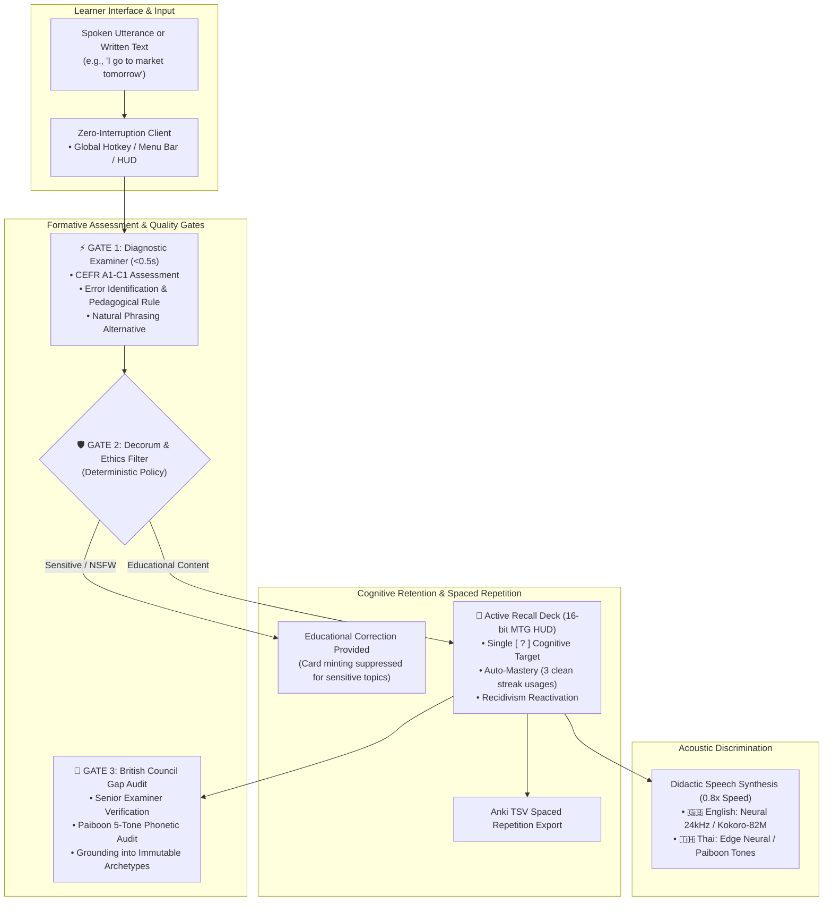
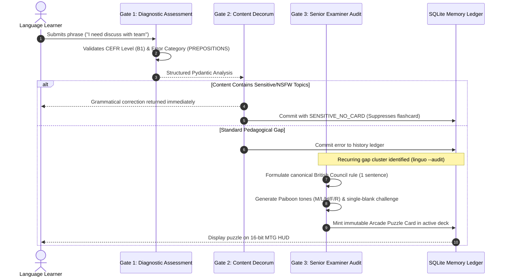
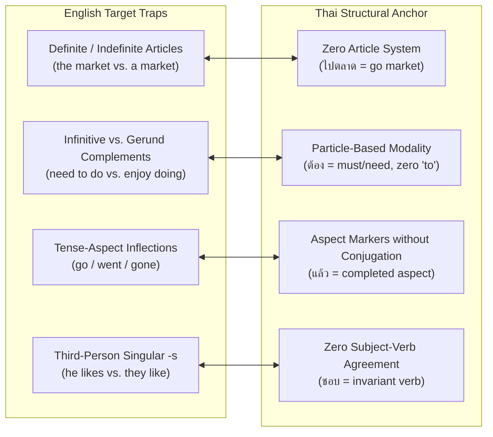
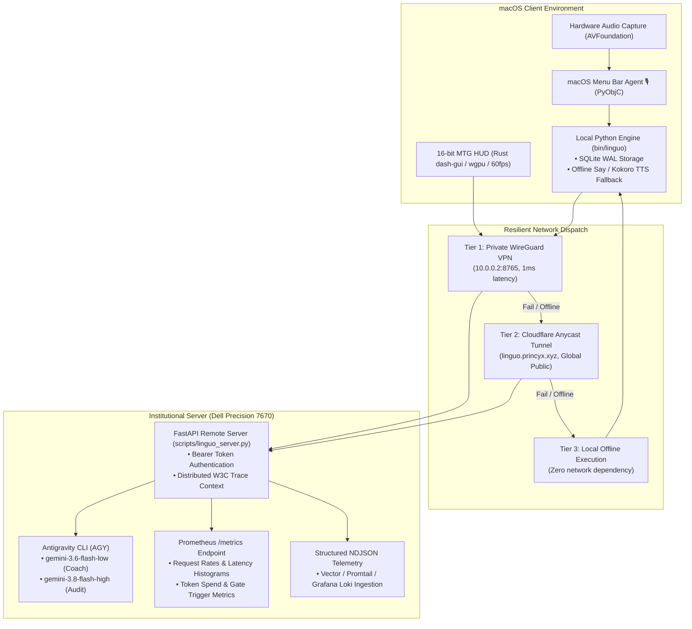

# Linguo: Intelligent Computer-Assisted Language Learning (CALL) System

> **A Pedagogical & Architectural Specification for British Council Examiners, Applied Linguists, and Academic Evaluators**  
> *Dual English-Thai Formative Assessment, Contrastive Linguistics, and Active Recall Cognitive Architecture*

<div align="center">
  
  <p><em><strong>Figure 1</strong>: Immutable 16-bit Active Recall Card generated by Linguo's British Council Audit Engine.<br/>
  Synthesizes Cued Production Testing (Single Cognitive Blank), Canonical Pedagogical Rules, Thai Contrastive Transliteration, and High-Affective Mnemonic Scaffolding.</em></p>
</div>

---

## 1. Executive Summary & Pedagogical Value Proposition

Traditional language learning software and contemporary generative AI assistants suffer from two complementary pedagogical flaws:
1. **Passive Correction without Metacognition**: Standard generative AI rewrites learner sentences automatically. While the output is polished, the learner remains passive, fostering reliance rather than internalizing syntactical schemas.
2. **Gamification without Syntactic Depth**: Mobile flashcard platforms frequently emphasize lexical rote memorization over systemic grammatical competence, ignoring cross-linguistic transfer traps and phonetic stress.

**Linguo** is an autonomous, real-time Computer-Assisted Language Learning (CALL) platform built upon foundational principles of **Second Language Acquisition (SLA)**:

* **Immediate Formative Feedback (<0.5s)**: In accordance with Long’s *Interaction Hypothesis*, communicative feedback is most effective when provided at the exact moment of communicative breakdown, before grammatical errors become fossilized.
* **Contrastive Linguistic Diagnosis**: Directly addresses structural transfer interference between English (a synthetic/analytic Germanic-Romance language with inflections, articles, and tense-aspect morphology) and Thai (an isolating, tonal Kra-Dai language with zero conjugation, zero grammatical gender, and no indefinite/definite articles).
* **Cognitive Active Recall & Desirable Difficulty**: Based on Bjork’s *Desirable Difficulties* framework, errors are not simply recorded; they are automatically synthesized into single-blank **Challenge Puzzles** requiring active retrieval, anchored in a 16-bit physical card interface.
* **Acoustic Phonetic Slowing (0.8x Pedagogy)**: Articulatory clarity is prioritized over natural conversational speed. Neural speech synthesis deliberately articulates English phonemes and Thai Paiboon tones at $0.80\times$ speed ($140\text{ wpm}$) to train perceptual phonemic discrimination in non-native adult learners.

---

## 2. Pedagogical Architecture

The following diagram illustrates how learner speech or written text transitions through formative diagnosis, institutional verification gates, cognitive flashcard minting, and acoustic synthesis.



---

## 3. The 3-Tier Pedagogical Quality Gate

To preserve institutional integrity and eliminate model hallucinations or stylistic degradation, Linguo routes every student interaction through **three distinct evaluation tiers**:



### Detailed Gate Responsibilities

| Tier | Institutional Role | Engine & Model Profile | Pedagogical Rationale |
| :--- | :--- | :--- | :--- |
| **Gate 1: Fast Diagnostic Assessment** | Immediate Formative Diagnosis | `gemini-3.6-flash-low` (Effort: low, 0 tools) | Formative feedback must arrive within $<0.5\text{s}$ to prevent cognitive distraction. Computes CEFR rating, pinpoint grammar tips, and natural native alternatives. |
| **Gate 2: Decorum & Ethics Filter** | Pedagogical Safety & Classroom Decorum | Deterministic Lexical & Semantic Scanner | If an adult learner utilizes sensitive or taboo language (violence, substances, explicit themes), the grammatical explanation is respectfully provided, but the creation of permanent gamified challenge cards is strictly blocked (`SENSITIVE_NO_CARD`). |
| **Gate 3: Senior Examiner Gap Audit** | Rigorous Pedagogical Review | `gemini-3.8-flash-high` (Effort: high, deep reasoning) | Evaluates recurring error clusters to formulate canonical British Council grammatical explanations, verifies 5-tone Paiboon phonetic breakdowns, and slots puzzles into fixed archetypes. |

---

## 4. Cognitive Architecture: Active Recall & Spaced Repetition

### 4.1 The Failure of Multiple Choice vs. Single-Blank Puzzles
Cognitive science demonstrates that recognition testing (multiple choice) induces an "illusion of competence". Linguo strictly enforces **Cued Production Testing**:
* Every generated challenge presents a single targeted blank `[  ?  ]`.
* The learner is forced to actively retrieve the grammatical particle or tense inflection from memory before pressing the spacebar to flip the card.

```
┌─────────────────────────────────────────────────────────────┐
│ ⚔️  THE 'TO' TOLL  •  B1  •  Fantasy RPG Guild               │
├─────────────────────────────────────────────────────────────┤
│ 🇬🇧 CHALLENGE PUZZLE:                                        │
│     "Avoid saying: 'I need discuss with my team'             │
│      Complete: 'I need [  ?  ] discuss with my team.'"      │
├─────────────────────────────────────────────────────────────┤
│ 🇹🇭 THAI CONTRASTIVE GROUNDING:                              │
│     ต้องคุย (dtɔ̂ng khui)  [ F / M ]                           │
│     ต้อง = dovere (Falling) | คุย = parlare (Mid)           │
├─────────────────────────────────────────────────────────────┤
│ 📖 BRITISH COUNCIL GRAMMAR RULE:                            │
│     Semi-modal verbs such as 'need' require the full        │
│     infinitive with 'to' when followed by another verb.     │
│                                                             │
│ 💬 GUILD MASTER:                                            │
│     "ACCESS DENIED! Insert 'TO' token into the machine!"    │
└─────────────────────────────────────────────────────────────┘
```

### 4.2 Zero-Drift Style Grounding (The Three Canonical Archetypes)
Unconstrained language models inevitably suffer from stylistic drift, alternating unpredictably between overly dry textbook summaries and informal banter. Linguo eliminates this through **Deterministic Slot-Filling** into **3 Canonical Archetypes**:

1. **Tactical Military Arcade** *(Persona: Drill Sergeant)*: Applied to Articles and Definite Destination gaps (*"THE MARKET STAMP: NO 'THE', NO ENTRY! Stamp approved, soldier!"*).
2. **Retro Sci-Fi Cyberpunk** *(Persona: Time Navigator)*: Applied to Tense and Aspect confusions (*"THE TIME PARADOX: Time stream breached! Drop present tense before the continuum breaks!"*).
3. **Fantasy RPG Guild** *(Persona: Guild Master)*: Applied to Verb Patterns and Prepositional Tolls (*"THE 'TO' TOLL: Insert 'TO' token into the machine!"*).

### 4.3 Adaptive Mastery Lifecycle & Recidivism Detection
* **Active Status (`is_mastered = 0`)**: Cards remain in the active daily recall deck.
* **Auto-Mastery (`is_mastered = 1`)**: When the learner demonstrates **3 consecutive error-free usages** of the target syntactical structure across subsequent dictations, the card automatically graduates to the Mastered archive.
* **Recidivism Reactivation**: If the same structural error is detected again in future speech, the card is immediately unmastered and placed back into the active deck.
* **Anki TSV Integration**: Puzzles, phonetic tables, and British Council rules export directly into Anki Desktop and AnkiMobile via tab-separated values.

---

## 5. Contrastive Linguistics & Acoustic Didactics

### 5.1 English $\leftrightarrow$ Thai Cross-Linguistic Matrix
For adult native speakers of non-inflected tonal languages (such as Thai, Vietnamese, or Mandarin), English presents specific phonological and morphosyntactic hurdles. Linguo explicitly scaffolds these transfer gaps:



### 5.2 Acoustic Phonetics: The 0.8x Didactic Benchmark
Normal native conversational speech ($175\text{ wpm}$) causes non-native listeners to miss critical unstressed function words (articles, prepositions, consonant clusters). Linguo mathematically calibrates its speech engines:
$$\text{Didactic Rate} = 175 \times 0.80 = 140\text{ wpm}$$
* **English Neural TTS**: Kokoro-82M (82-million parameter neural model operating locally on CPU) or Studio Edge-TTS, rendering British (`af_nicole`) and American (`am_adam`, `Alex`, `Samantha`) phonetic models.
* **Thai Tonal Paiboon Transliteration**: Pairs Thai script with standardized Paiboon phonetic spelling and explicit 5-tone pitch indicators:
  $$\text{Mid (M)} \quad|\quad \text{Low (L)} \quad|\quad \text{High (H)} \quad|\quad \text{Falling (F)} \quad|\quad \text{Rising (R)}$$

---

## 6. System Architecture & Topology

Linguo combines a lightweight, native client on macOS with an optional high-performance inference and telemetry server.



---

## 7. Institutional Observability & Telemetry

For deployment within university language labs and British Council testing centers, Linguo complies with enterprise SRE observability standards:

* **Prometheus Metrics (`GET /metrics`)**: Exposes request rates (`linguo_requests_total`), latency histograms partitioned by inference engine (`linguo_inference_duration_seconds`), active connections, and safety gate activations.
* **Structured NDJSON Event Streaming**: Emits single-line JSON log events (`linguo_events.jsonl` and stdout) for instantaneous ingestion by Vector, Promtail, and Grafana Loki.
* **Distributed W3C Tracing (`X-Trace-Id`)**: Propagates end-to-end trace IDs from macOS client clicks through to the Dell backend, enabling complete performance profiling in Grafana Tempo.
* **Automated Health Probes**: Dual `/health/live` (process liveness) and `/health/ready` (validates runtime file system permissions and CLI engine readiness).

---

## 8. Demonstration & Quickstart Guide

### 8.1 System Requirements
* **Operating System**: macOS 13+ (Apple Silicon or Intel).
* **Python**: Python 3.10+ (with Pydantic v2).
* **Rust**: Rust 1.80+ (optional, for compiling the native Metal HUD).
* **Audio Tools**: `ffmpeg` (for microphone ingestion).

### 8.2 Installation

```bash
# 1. Clone the repository
git clone https://github.com/gptprojectmanager/linguo.git
cd linguo

# 2. Run the automated installer (symlinks CLI and builds dependencies)
./install.sh

# 3. Optional: Compile the native 60fps Metal HUD
./install_gui.sh
```

### 8.3 Evaluator Live Demo Script (3-Minute Walkthrough)

#### Step 1: Real-Time Formative Diagnosis
Submit a phrase featuring a common cross-linguistic transfer error:
```bash
linguo "I go to market yesterday with my friend"
```
*Expected Output*: Instantaneous identification of the double error: missing definite article before specific location (*"to the market"*) and incorrect past tense inflection (*"went"*), accompanied by CEFR rating and Thai contrastive Paiboon gloss.

#### Step 2: Content Decorum Filter (Gate 2 Safety)
Submit a sensitive phrase to observe pedagogical decorum:
```bash
linguo "He wanted to buy a gun before shooting"
```
*Expected Output*: Grammatical repair is provided professionally, but Gate 2 flags `SENSITIVE_NO_CARD`. Card creation is blocked to maintain an educational environment.

#### Step 3: British Council Gap Audit (Gate 3)
Trigger a deep pedagogical audit on recorded gaps:
```bash
linguo --audit
```
*Expected Output*: A senior examiner audit using `gemini-3.8-flash-high` synthesizes recurring learner errors into a canonical British Council rule and generates an immutable challenge card.

#### Step 4: Launch the 16-Bit MTG Active Recall HUD
```bash
linguo-gui
# Or open /Applications/Linguo.app
```
*Interact*: Use the `Spacebar` to test active recall, `E` to listen to 0.8x English neural speech, `T` for Thai Paiboon pronunciation, and `M` to toggle mastery.

#### Step 5: Execute the Unified Test Suite
Verify that all 46 automated unit tests, Pydantic schemas, and Prometheus endpoints pass:
```bash
./tests/test_all.sh
```

---

## 9. Academic & Technical Governance

* **Authors**: Linguo Applied Linguistics & AI Systems Group
* **License**: MIT License
* **Repository**: [https://github.com/gptprojectmanager/linguo](https://github.com/gptprojectmanager/linguo)
* **Citation**: If utilizing Linguo for SLA research or computer-assisted language learning trials, please cite this repository as an open CALL reference implementation.
