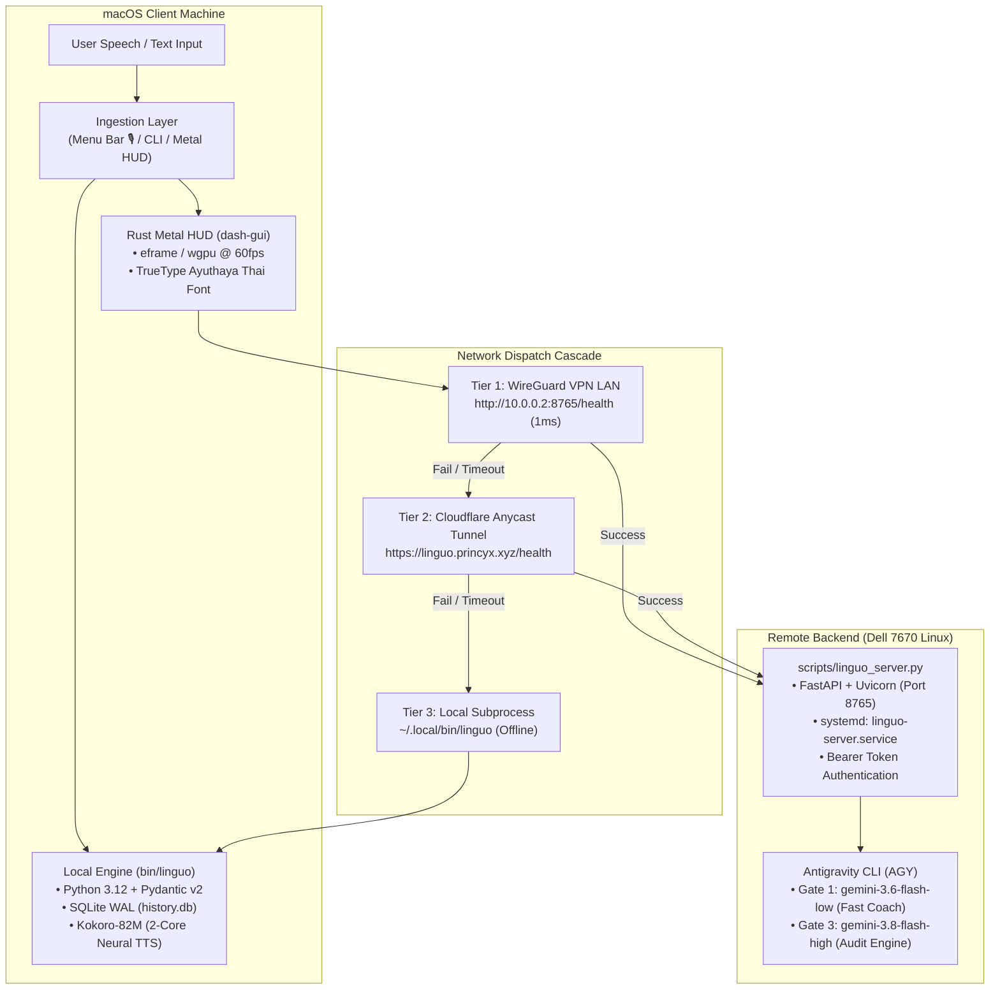
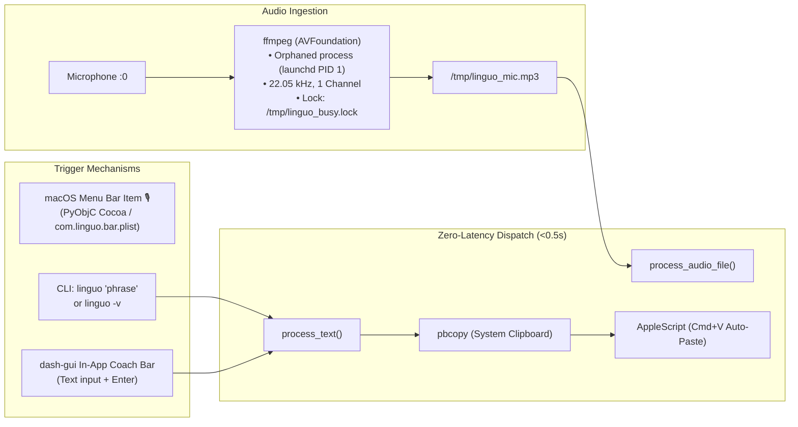
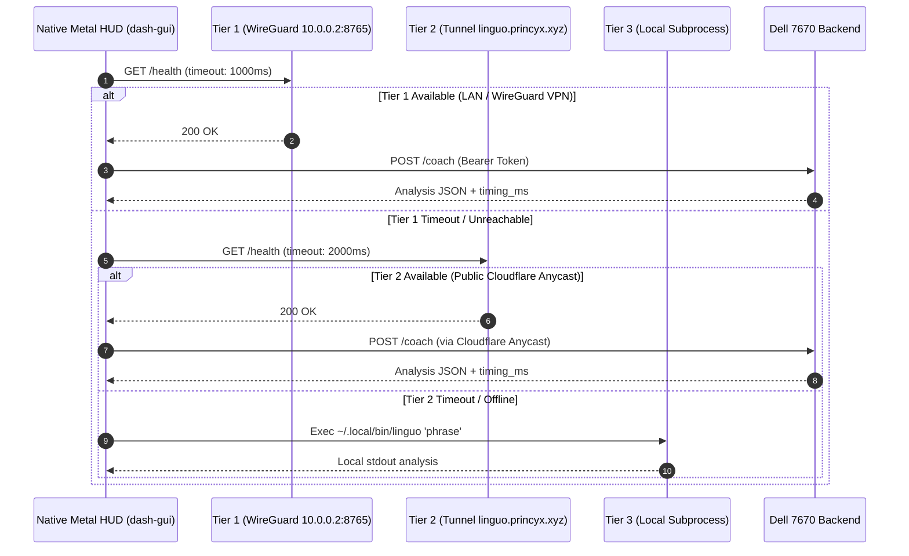
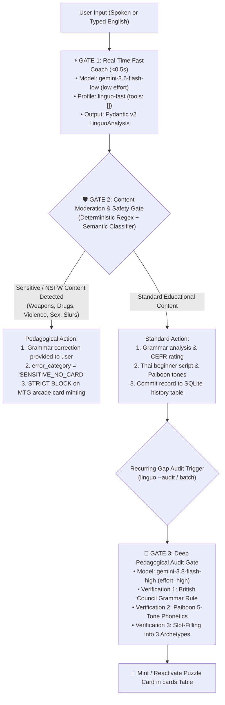
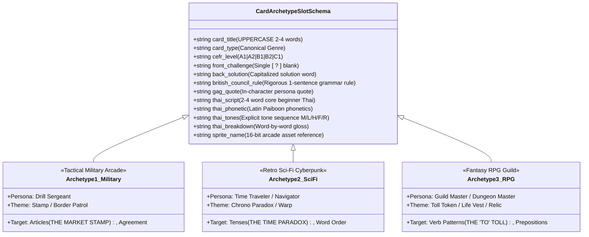
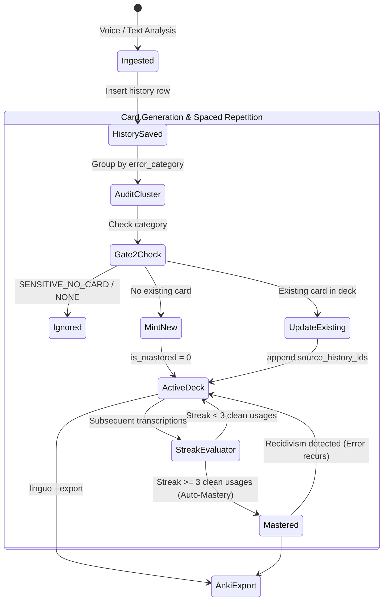
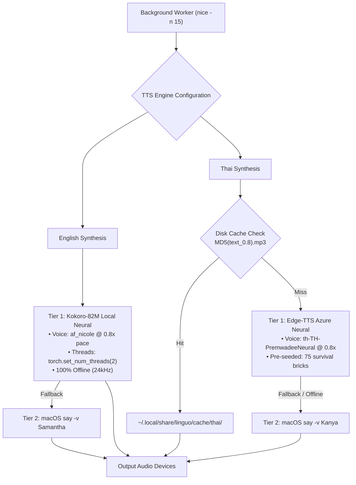

# Linguo: Dual English-Thai Language Acquisition Engine

> Technical specification, system topology, and component architecture for the Linguo dual-coach ecosystem.

---

## 1. System Topology & Global Architecture

Linguo is an asynchronous, dual-coach pedagogical system designed for real-time speech correction, active recall flashcard generation, and bilingual audio synthesis. The infrastructure spans macOS clients and an optional high-performance Linux remote backend (Dell Precision 7670), communicating over private VPN, Cloudflare Anycast tunnel, or local fallback.



---

## 2. Ingestion & Input Pipeline

The client accepts audio from the hardware microphone or raw text from keyboard interfaces, immediately dispatching analysis without blocking active applications.



### Component Details
* **Entry Script**: [`bin/linguo`](file:///Users/sam/linguo/bin/linguo)
* **Audio Capture Engine**: Native `ffmpeg` via macOS AVFoundation device `:0` spawned detached via two-stage `os.fork()` reparented to `launchd` (PID 1).
* **Auto-Paste Driver**: `osascript -e 'tell application "System Events" to keystroke "v" using command down'`.
* **Locking Mechanism**: `/tmp/linguo_busy.lock` prevents overlapping recordings.

---

## 3. Network & Dual Dispatch Cascade (Smart 3-Tier Probe)

When running the native client ([`dash-gui`](file:///Users/sam/linguo/gui/dash-gui/src/main.rs)), request dispatch probes an automatic 3-tier cascade to guarantee uninterrupted service whether the user is on the private LAN, abroad, or offline.



### Protocol & Security Specification
* **Backend Implementation**: [`scripts/linguo_server.py`](file:///Users/sam/linguo/scripts/linguo_server.py) (FastAPI + Uvicorn) running on systemd service `linguo-server.service` on `sam7670`.
* **Authentication**: HTTP Authorization Header `Bearer <LINGUO_API_TOKEN>`.
* **Tunnel Configuration**: Cloudflare Zero Trust tunnel `home-recovery` routing public Anycast requests to `localhost:8765`.
* **Fallback Degradation**: Pure local execution when offline.

---

## 4. Language Inference & 3-Tier Quality Gates

To prevent pedagogical inaccuracies, linguistic hallucinations, and stylistic drift, input evaluation is structured into **3 progressive Quality Gates**:



### Gate Specification

| Gate | Model / Engine | Latency | Responsibility | Constraints |
| :--- | :--- | :--- | :--- | :--- |
| **Gate 1** | `gemini-3.6-flash-low` | <0.5s | Immediate feedback, CEFR rating (A1-C1), Level-Up phrasing, Thai transliteration. | Zero tool calls (`tools: []`), minimal token footprint. |
| **Gate 2** | Deterministic Regex + Classifier | <1ms | Decorum and safety filtering for weapons, illicit substances, NSFW, and hate speech. | Educational correction is retained; card minting is strictly suppressed via `SENSITIVE_NO_CARD`. |
| **Gate 3** | `gemini-3.8-flash-high` | ~2-4s | Deep pedagogical audit for recurring gap clusters (`linguo audit`). | Reasoning effort `high`. Enforces British Council grammar rules, Paiboon tone verification, and 3 canonical archetypes. |

---

## 5. Style Grounding & Zero-Drift Archetype Architecture

To prevent generative models from degrading or altering style, humor, or formatting over time, Linguo forbids freeform markdown creation for cards. It enforces **Deterministic Slot-Filling** into **3 Canonical Archetypes** stored permanently in SQLite:



---

## 6. Persistence & Card Lifecycle State Machine

All application records are persisted in a thread-safe SQLite database running in Write-Ahead Logging (WAL) mode (`~/.local/share/linguo/history.db`).



### Database Schema Definition

```sql
-- Historical transcriptions and speech analyses
CREATE TABLE history (
    id INTEGER PRIMARY KEY AUTOINCREMENT,
    timestamp DATETIME DEFAULT CURRENT_TIMESTAMP,
    original_text TEXT NOT NULL,
    is_correct INTEGER NOT NULL,
    corrected_english TEXT NOT NULL,
    grammar_tip TEXT,
    thai_script TEXT NOT NULL,
    thai_phonetic TEXT NOT NULL,
    thai_breakdown TEXT,
    audio_thai_path TEXT,
    audio_eng_path TEXT,
    english_level TEXT DEFAULT 'B1',
    english_better_alternative TEXT,
    pronunciation_tip TEXT,
    thai_grammar_tip TEXT,
    is_starred INTEGER DEFAULT 0,
    error_category TEXT DEFAULT 'NONE'
);

-- Active Recall MTG Puzzle Cards
CREATE TABLE cards (
    id INTEGER PRIMARY KEY AUTOINCREMENT,
    created_at DATETIME DEFAULT CURRENT_TIMESTAMP,
    error_category TEXT NOT NULL,
    sprite_name TEXT NOT NULL,
    card_title TEXT NOT NULL,
    cefr_level TEXT DEFAULT 'B1',
    card_type TEXT NOT NULL,
    front_challenge TEXT NOT NULL,
    back_solution TEXT NOT NULL,
    british_council_rule TEXT NOT NULL,
    gag_quote TEXT,
    thai_script TEXT NOT NULL,
    thai_phonetic TEXT NOT NULL,
    thai_tones TEXT NOT NULL,
    thai_breakdown TEXT,
    source_history_ids TEXT,
    is_mastered INTEGER DEFAULT 0
);

-- Immutable Canonical Card Archetypes
CREATE TABLE card_archetypes (
    category TEXT PRIMARY KEY,
    sprite_name TEXT NOT NULL,
    card_title TEXT NOT NULL,
    cefr_level TEXT DEFAULT 'B1',
    card_type TEXT NOT NULL,
    front_challenge TEXT NOT NULL,
    back_solution TEXT NOT NULL,
    british_council_rule TEXT NOT NULL,
    gag_quote TEXT,
    thai_script TEXT NOT NULL,
    thai_phonetic TEXT NOT NULL,
    thai_tones TEXT NOT NULL,
    thai_breakdown TEXT
);
```

---

## 7. Multi-Tier Audio Synthesis Pipeline

Audio generation is decoupled from client latency through a background worker running at reduced CPU priority (`nice -n 15`).



---

## 8. Frontend & User Interface Architectures

### 8.1 Native Desktop HUD ([`gui/dash-gui`](file:///Users/sam/linguo/gui/dash-gui))
* **Technology**: Rust 2021, `eframe` (egui 0.28) utilizing the macOS **Metal** graphics backend.
* **Performance Profile**: 60 frames per second, 0.0% CPU at idle, ~15 MB resident memory.
* **Typography**: Integrated Apple TrueType font `/System/Library/Fonts/Supplemental/Ayuthaya.ttf` for native Thai glyph rendering.
* **Window Features**: Always-on-Top floating pinning (`[P]`), interactive live coaching search bar, interactive Configuration Matrix modal (`⚙️ Config` / `[C]`), and full keyboard navigation.

### 8.2 macOS Menu Bar Accessory
* **Technology**: PyObjC Cocoa (`NSStatusBar`, `NSStatusItem`).
* **Lifecycle**: Managed via user `launchd` agent (`~/Library/LaunchAgents/com.linguo.bar.plist`).
* **Interaction**:
  * Left-Click: Toggle voice capture (`🔴 Rec...` -> `⚡ Proc...` -> `🎙️`).
  * Right-Click: Native contextual menu (Practice toggle, open HUD, clean quit).

### 8.3 Terminal ADHD Curses Board (`lb`)
* **Technology**: Python standard `curses` split-view terminal interface.
* **Features**: Active recall flashcard masking (`f`), 3-cycle audio loop (`l`), favorite bookmarking (`s`), and unrevealed mystery testing.

---

## 9. Observability, Latency Tracing & Diagnostics

### 9.1 Diagnostic Verification Engine (`linguo --doctor`)
Verifies all 7 structural pillars of the operating environment:

| Pillar | Subsystem Checked | Verification Criteria |
| :--- | :--- | :--- |
| **1. Engine Core & DB** | Python 3.12, Pydantic v2, SQLite | Pydantic v2 active, SQLite journal mode = WAL, mandatory tables present. |
| **2. Audio Pipeline** | Kokoro-82M, Edge-TTS, `say` | PyTorch initialized, cache bricks verified, Samantha & Kanya voices present. |
| **3. Permissions & TCC** | Microphone, System Events, `ffmpeg` | AVFoundation mic access granted, AppleScript keystroke permission enabled. |
| **4. Rust Metal HUD** | `dash-gui` binary & typography | Compiled binary exists and is executable, Ayuthaya font located. |
| **5. Active Recall Deck** | Spaced Repetition Engine | Active vs. mastered card counts verified, auto-mastery rules operational. |
| **6. Logging & Tracing** | Retention & Profiling | Microsecond profiler operational, 30-day rotating log retention enforced. |
| **7. Menu Bar Agent** | `launchd` / LaunchAgent | `com.linguo.bar.plist` registered and active in user session. |

### 9.2 Fine-Grained Latency Profiling (`linguo --trace`)
Profiles execution latency across each discrete stage of the pipeline:

```text
⏱️  Execution Latency Trace: 'I want to improve my...'
  • 1_db_init             :    0.34 ms (  0.0%) 
  • 2_clipboard_copy      :    8.12 ms (  0.6%) 
  • 3_llm_inference       : 1245.50 ms ( 95.8%) ████████████████████
  • 4_db_and_markdown_save:    4.20 ms (  0.3%) 
  • 5_terminal_card_render:    1.15 ms (  0.1%) 
  • 6_tts_worker_dispatch :    0.85 ms (  0.1%) 
  ──────────────────────────────────────────
  🏁 Total Pipeline       : 1260.16 ms
```

---

## 10. CLI Command Reference

```bash
# Core Operations
linguo "Your sentence here"      # Run instant analysis & audio dispatch
linguo --trace "Your sentence"   # Run analysis with detailed latency breakdown
linguo -v                        # Record directly from microphone

# Active Recall Deck (MTG Puzzle Cards)
linguo --cards                   # View active recall challenge cards
linguo --cards --flip 1          # Reveal solution, grammar rule, and gag for card #1
linguo --cards --master 1        # Manually archive card #1 as mastered
linguo --audit                   # Execute Gate 3 British Council audit via Flash 3.8 High
linguo --audit --no-review       # Execute rapid audit without LLM escalation

# User Interfaces
linguo --gui                     # Launch native Rust Metal HUD (dash-gui)
linguo --board                   # Open curses terminal board (lb)

# Operational Configuration Matrix
linguo config                    # Display full operational matrix table
linguo config model <fast|balanced|pro>  # Set Real-Time Coach tier (Flash 3.6 / 3.7 / 3.8)
linguo config card <canon|balanced|studio> # Set Card Production quality (0 Token / 3.7 / 3.8 High)
linguo config tts <hybrid|local|edge>    # Set speech synthesis engine
linguo config speed <0.75|0.8|1.0>       # Set didactic playback pace
linguo config voice <nicole|samantha|adam|alex> # Set English voice (2 female + 2 male)
linguo config route <auto|dell|local>    # Set network dispatch cascade
linguo config reset              # Restore all parameters to canonical defaults

# macOS Menu Bar Agent Management
linguo --status-bar              # Display current launchd status of the menu bar agent
linguo --install-bar             # Install and load ~/Library/LaunchAgents/com.linguo.bar.plist
linguo --uninstall-bar           # Unload and remove LaunchAgent

# Diagnostics & Maintenance
linguo --doctor                  # Run full 7-pillar diagnostic verification
linguo --logs                    # View recent entries from 30-day rotating logs
linguo --preseed                 # Cache 75 core survival Thai audio bricks to disk
linguo --export                  # Export active deck to Anki-compatible TSV format
```

---

## 11. Security & Pre-Commit Gates

* **Deterministic Secret Scanner**: [`scripts/check_secrets.sh`](file:///Users/sam/linguo/scripts/check_secrets.sh) scans all staged and working files for cloud tokens, private keys, and API secrets prior to any git commit.
* **Pre-Commit Hook**: Automated validation runs on every commit via `.git/hooks/pre-commit`.
* **CI Verification**: GitHub Actions automatically runs automated testing and secret scans on pull requests and releases.

---

## 12. Verification & Automated Test Suite

Run the full end-to-end regression suite ([`tests/test_all.sh`](file:///Users/sam/linguo/tests/test_all.sh)):

```bash
./tests/test_all.sh
```

Verifies:
1. Python syntax & compilation
2. Pydantic v2 schema validation & auto-healing
3. 7-pillar system diagnostics (`linguo --doctor`)
4. SQLite WAL persistence & table integrity
5. British Council gap audit engine
6. Anki TSV export generator
7. Rust `dash-gui` Metal binary compilation & execution
8. Gate 2 Content Moderation & `SENSITIVE_NO_CARD` filtering
9. macOS LaunchAgent registration status

---

## 13. Packaging & Distribution (macOS Zero-Terminal Setup)

For non-technical users requiring a zero-terminal installation:

1. **DMG Distribution**: Run [`scripts/bundle_dmg.sh`](file:///Users/sam/linguo/scripts/bundle_dmg.sh) to generate `dist/Linguo-0.3.1.dmg`.
2. **Installation**: Open the DMG and drag `Linguo.app` into `/Applications`.
3. **Usage**: Click the `🎙️` icon in the macOS menu bar or open `Linguo.app` to interact with the practice HUD. Zero terminal access or shell commands are required.
